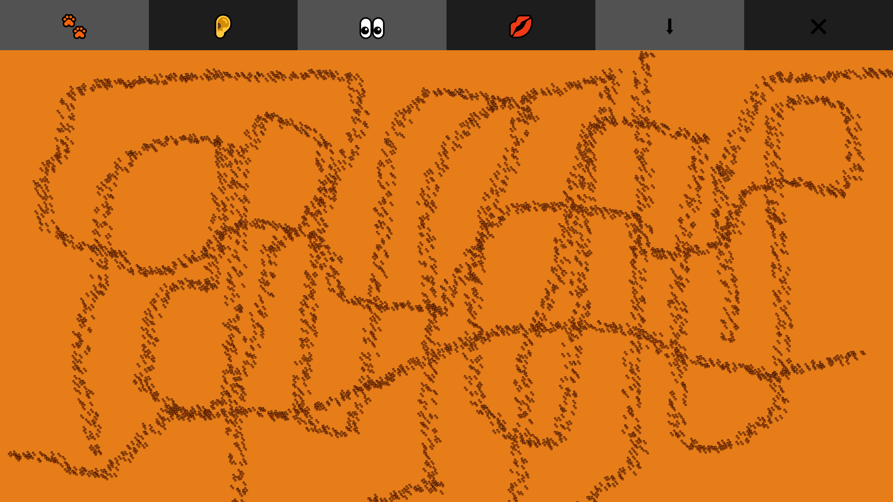
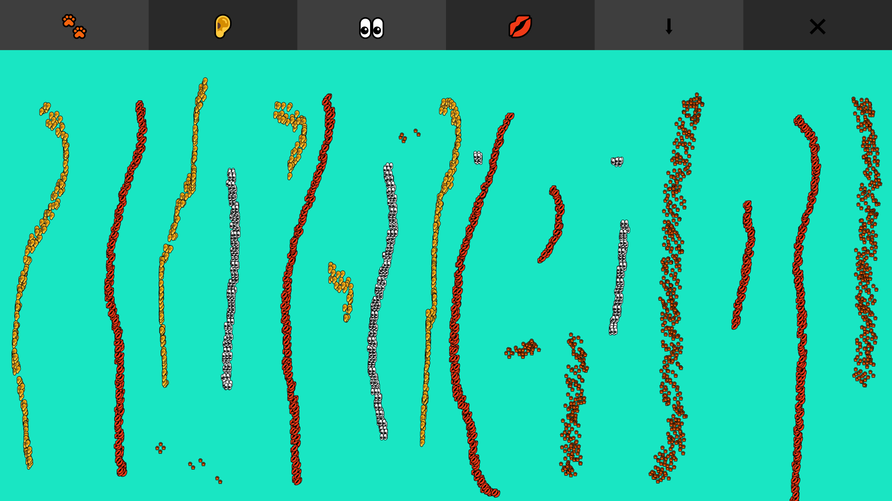

# [Play my drawing tool here.](https://emojidraw.netlify.app/)

# Demo pictures below.

# Reference

I played around with brush tools with the help with amazing tutorials made by Max Bittker. [Here is his final code on sandbox.](https://codesandbox.io/s/interpolated-lines-checkpoint-zgu34) 

His tutorials on [interpolation of points](https://www.loom.com/share/9ca841dcfc85445eb10a0f4a1c4888e6) and [textured lines with randomness](https://www.loom.com/share/1f91ad1b928144c88951bf0dd307ffca) are so helpful! 

I had several ideas before making the drawing tool. Here are some ideas I still wanna pursue in my future projects:

1. changing lineWidth based on time spent on drawing
2. changing color into rainbow - I succeeded in creating gradient in js for fillrect() but not for arc()